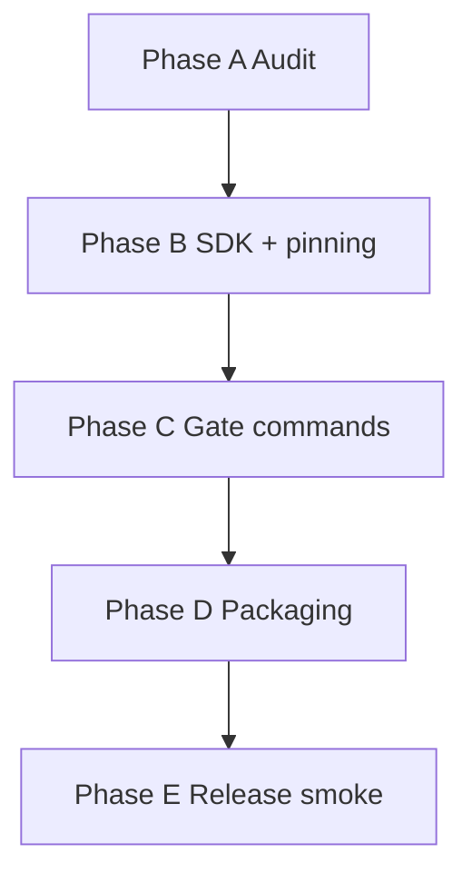

# VP-Hub Revit integration — extended reference

## Kit layout (after adopt)

```text
MyRevitPlugin/
├── .cursor/skills/          # from kit adopt
├── libs/LicensingSystem.*/  # vendored SDK (or NuGet)
├── packaging/               # from templates/packaging
├── src/...
└── version.json
```

## Adoption levels

| Level | What adopt copies |
|-------|-------------------|
| SkillsOnly | `.cursor/skills/*`, `.cursor/rules/*` |
| Full | + `libs/`, `packaging/` templates, `docs/templates/` |

Script: `scripts/adopt-into-project.ps1`.

## Phase dependencies



## Support placeholders

Operator fills [`SUPPORT.md`](../../../SUPPORT.md): min agent version, support contact, NuGet feed URL.

## Maintainer sync

When IPC/contracts change in LicensingSystem monorepo, run `scripts/sync-from-licensingsystem.ps1` (read-only source). See [`MAINTAINERS.md`](../../../MAINTAINERS.md).
